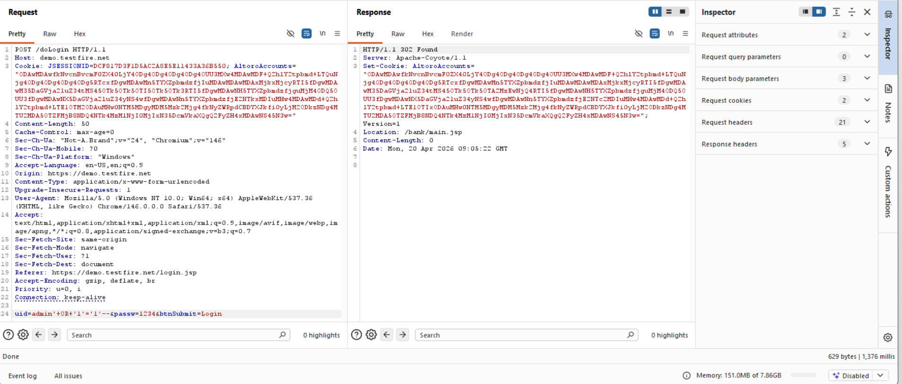
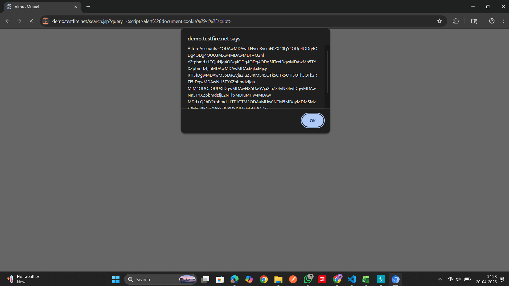
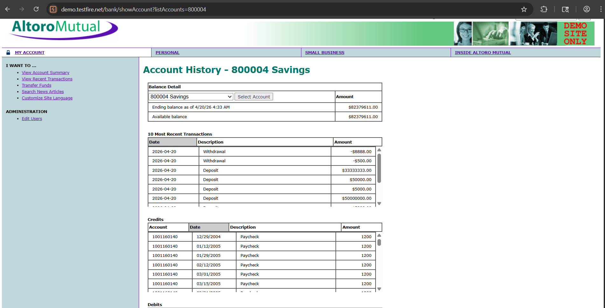
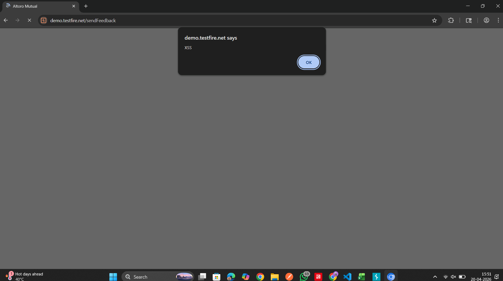
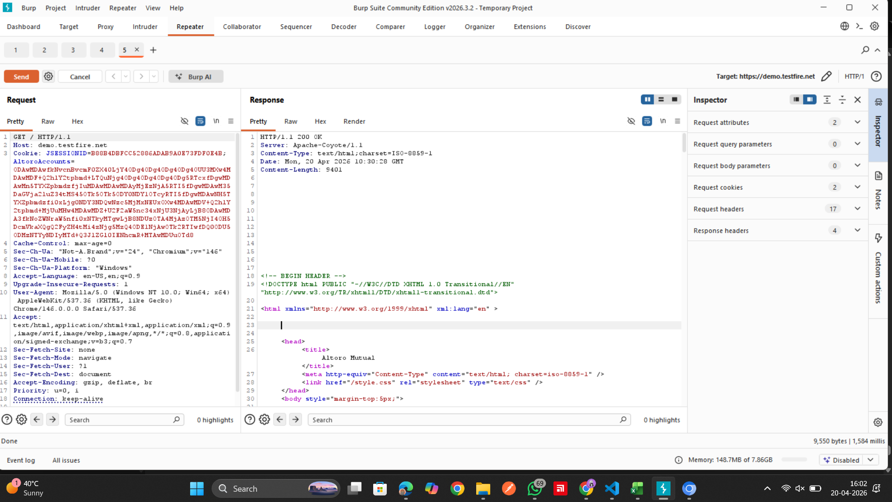
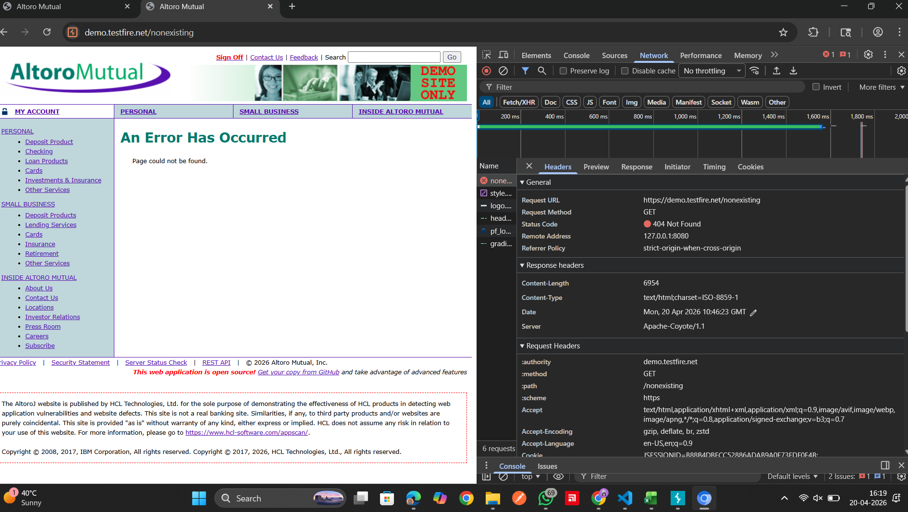

# Application Vulnerability Assessment and Penetration Testing Report
## Capstone Project — AltoroMutual & Zero Bank Demo Applications

---

| Field | Details |
|-------|---------|
| **Report Release Date** | 20-04-2026 |
| **Type of Audit** | Application Vulnerability Assessment and Penetration Testing |
| **Type of Report** | Capstone Assessment Report |
| **Period** | [Capstone Day — Single Day] |

---

## Document Control

| Field | Details |
|-------|---------|
| **Document Title** | Capstone VAPT Report |
| **Document ID** | CAPSTONE-VAPT-001 |
| **Document Version** | 1.0 |
| **Prepared by** | Adwita Jindal |
| **Reviewed by** | Mukesh Chaudhari (Instructor) |
| **Team Name** | SecureOps |

---

## Table of Contents

1. Introduction
2. Engagement Scope
3. Assessment Methodology
4. Tools Used
5. Executive Summary
6. Detailed Observations
7. Recommendations Summary
8. Appendix: Screenshots

---

## 1. Introduction

### Project Background

This Vulnerability Assessment and Penetration Testing (VAPT) report was produced as part of the Cybersecurity Training capstone project conducted by Paytm Payments Services in partnership with Zell Education and Chitkara University. The assessment targeted two intentionally vulnerable web applications — **AltoroMutual (demo.testfire.net)** and **Zero Web App Security (zero.webappsecurity.com)** — to simulate a real-world security audit of financial technology applications.

The primary objective was to identify technical and logical vulnerabilities within these web applications using manual testing techniques and Burp Suite Community Edition, applying knowledge gained throughout the 5-day cybersecurity training programme covering cryptography, web security fundamentals, OWASP Top 10, ethical hacking, and regulatory compliance.

### Objective

Conduct a comprehensive VAPT process to identify and assess vulnerabilities in the target web applications, document findings with proof-of-concept evidence, assess business impact, and provide actionable remediation recommendations — following the same methodology used by professional penetration testing firms.

### Assumptions

- Testing was conducted on publicly available demo/training applications designed to contain vulnerabilities.
- All testing was performed with authorisation (these are intentionally vulnerable applications for educational purposes).
- Findings reflect the application state at the time of testing.
- This report follows the CERT-In audit report format and OWASP Testing Guide v4 methodology.

---

## 2. Engagement Scope

| # | Asset Description | Criticality | URL | Type |
|---|------------------|-------------|-----|------|
| 1 | AltoroMutual Demo Bank | High | https://demo.testfire.net | Web Application |
| 2 | Zero Web App Security | High | http://zero.webappsecurity.com | Web Application |

**In Scope:**
- Authentication mechanisms (login, session management)
- Input validation (SQL injection, XSS, command injection)
- Access control (IDOR, privilege escalation, path traversal)
- Session management (timeout, concurrent sessions, token security)
- Security headers and configuration
- Error handling and information disclosure

**Out of Scope:**
- Denial of Service (DoS) attacks
- Social engineering
- Physical security
- Network infrastructure testing
- Server-side code review (black-box testing only)

---

## 3. Assessment Methodology

The assessment followed the OWASP Testing Guide v4 methodology:

### Phase 1: Information Gathering
- Collected target URLs and identified application features
- Mapped the attack surface (login, search, transfer, feedback, bill pay)
- Identified technologies used (server headers, JavaScript frameworks)

### Phase 2: Automated Scanning
- Configured Burp Suite proxy to intercept all HTTP traffic
- Browsed all application features with proxy active to build site map
- Reviewed HTTP History for interesting endpoints and parameters

### Phase 3: Manual Testing
- Tested all identified input fields for injection vulnerabilities (SQLi, XSS)
- Tested access controls by manipulating session tokens, account IDs, and URL parameters
- Tested session management (timeout, concurrent sessions, cookie attributes)
- Tested security headers using Burp Suite response inspection

### Phase 4: Exploitation & Documentation
- Exploited confirmed vulnerabilities to demonstrate impact
- Captured Burp Suite screenshots as proof of concept for each finding
- Scored each vulnerability using CVSS 3.1

### Phase 5: Reporting
- Documented all findings with description, impact, recommendation, and PoC
- Classified by OWASP Top 10 2021 category
- Prioritised by severity for remediation

---

## 4. Tools Used

| # | Tool | Version | Type |
|---|------|---------|------|
| 1 | Burp Suite Community Edition | Latest | Licensed (Free) |
| 2 | Google Chrome DevTools | Latest | Built-in |
| 3 | Browser (Chrome/Firefox) | Latest | N/A |

---

## 5. Executive Summary

A total of **6 vulnerabilities** were identified across both target applications during the assessment:

| Severity | Count |
|----------|-------|
| **Critical** | 1 |
| **High** | 3 |
| **Medium** | 1 |
| **Low** | 1 |
| **Total** | **6** |

### Observation Summary Table

| # | Affected Application | Observation Title | CWE | Severity | OWASP Category | New/Repeat |
|---|---------------------|-------------------|-----|----------|----------------|------------|
| 1 | demo.testfire.net/login.jsp | SQL Injection — Login Bypass | CWE-89 | Critical | A03:2021 | New |
| 2 | demo.testfire.net/search.jsp | Reflected XSS in Search | CWE-79 | High | A03:2021 | New |
| 3 | demo.testfire.net/bank/showAccount | Broken Access Control — IDOR | CWE-639 | High | A01:2021 | New |
| 4 | demo.testfire.net/feedback.jsp | Stored XSS in Feedback Form | CWE-79 | High | A03:2021 | New |
| 5 | demo.testfire.net | Missing Security Headers | CWE-693 | Medium | A05:2021 | New |
| 6 | demo.testfire.net | Information Disclosure in Errors | CWE-209 | Low | A05:2021 | New |

### Risk Distribution

The most critical finding is a **SQL Injection vulnerability** in the AltoroMutual login page that allows complete authentication bypass and potential full database compromise. Three **High severity** findings relate to XSS (both reflected and stored) and broken access control (IDOR), which together could enable session hijacking, data theft, and unauthorised access to customer accounts.

---

## 6. Detailed Observations

---

### Observation 1: SQL Injection — Login Bypass

| Field | Detail |
|-------|--------|
| **Severity** | Critical |
| **CVSS Score** | 9.8 |
| **CWE** | CWE-89: Improper Neutralisation of Special Elements used in an SQL Command |
| **OWASP** | A03:2021 — Injection |
| **Affected Asset** | https://demo.testfire.net/login.jsp |
| **Status** | New |

**Description:**
The login form concatenates user-supplied input directly into the SQL query without parameterisation. By injecting SQL syntax into the username field, an attacker can modify the query logic to bypass authentication entirely.

**Impact:**
An attacker can log in as any user including administrator without knowing the password. With UNION-based extensions, the attacker can extract data from any table in the database — including customer PII, account balances, and transaction histories. In a real banking application, this would constitute a catastrophic data breach affecting all customers.

**Steps to Reproduce:**
1. Navigate to https://demo.testfire.net/login.jsp
2. In the username field, enter: `admin' OR '1'='1'--`
3. In the password field, enter any value (e.g., "x")
4. Click "Login"
5. Observe: You are logged in as the admin user without a valid password

**Resulting SQL Query:**
```sql
SELECT * FROM users WHERE username='admin' OR '1'='1'--' AND password='x'
```
The `--` comments out the password check. The `OR '1'='1'` always evaluates to true.

**Recommendation:**
- Replace string concatenation with parameterised queries (prepared statements)
- Use an ORM framework (e.g., Hibernate, SQLAlchemy) for all database interactions
- Apply input validation: reject special characters in username field
- Deploy WAF rules to block common SQLi patterns as defence-in-depth
- Apply least-privilege database permissions

**Reference:** OWASP SQL Injection Prevention Cheat Sheet

---

### Observation 2: Reflected XSS in Search

| Field | Detail |
|-------|--------|
| **Severity** | High |
| **CVSS Score** | 6.1 |
| **CWE** | CWE-79: Improper Neutralisation of Input During Web Page Generation |
| **OWASP** | A03:2021 — Injection |
| **Affected Asset** | https://demo.testfire.net/search.jsp |
| **Status** | New |

**Description:**
The search function echoes user input directly into the HTML response without output encoding. Entering HTML/JavaScript in the search field causes it to be rendered and executed by the browser.

**Impact:**
An attacker can craft a malicious URL containing JavaScript that, when clicked by a victim, executes in their browser session. This enables session hijacking (cookie theft), credential phishing (injecting fake login forms), and performing actions on behalf of the victim.

**Steps to Reproduce:**
1. Navigate to the search page
2. Enter: `<script>alert(document.cookie)</script>`
3. Observe: Alert box displays the session cookie

**Recommendation:**
- Implement output encoding (HTML entities) for all user-supplied data before rendering
- Deploy Content-Security-Policy (CSP) headers to restrict script execution
- Set HTTPOnly flag on session cookies to prevent JavaScript access
- Apply input validation (reject HTML tags in search queries)

---

### Observation 3: Broken Access Control — IDOR

| Field | Detail |
|-------|--------|
| **Severity** | High |
| **CVSS Score** | 7.5 |
| **CWE** | CWE-639: Authorisation Bypass Through User-Controlled Key |
| **OWASP** | A01:2021 — Broken Access Control |
| **Affected Asset** | https://demo.testfire.net/bank/showAccount |
| **Status** | New |

**Description:**
After authentication, the application uses sequential account IDs in URL parameters to identify which account data to display. Changing this ID allows access to other users' account details without any server-side authorisation check.

**Impact:**
An attacker can enumerate account IDs and view any customer's account balance, transaction history, and personal information. In a real banking application, this would expose the financial data of all customers.

**Steps to Reproduce:**
1. Login as a valid user
2. Navigate to account details page
3. Note the account ID in the URL or request parameters
4. Modify the account ID to a different value (e.g., increment by 1)
5. Observe: Another user's account details are displayed

**Recommendation:**
- Implement server-side authorisation checks on every request
- Verify that the authenticated user owns the requested resource
- Use indirect object references (UUIDs) instead of sequential IDs
- Log and alert on access attempts to resources not owned by the user

---

### Observation 4: Stored XSS in Feedback Form

| Field | Detail |
|-------|--------|
| **Severity** | High |
| **CVSS Score** | 8.1 |
| **CWE** | CWE-79 |
| **OWASP** | A03:2021 — Injection |
| **Affected Asset** | https://demo.testfire.net/feedback.jsp |

**Description:**
The feedback form accepts and stores user input without sanitisation. Malicious scripts injected via the comment field persist in the database and execute automatically when any user or administrator views the feedback page.

**Impact:**
Stored XSS is more dangerous than reflected XSS because it affects ALL users who view the page — no social engineering required. An attacker could steal admin session tokens, deface the application, or redirect users to phishing sites.

**Recommendation:**
- Sanitise and encode all user input before storage and rendering
- Implement Content-Security-Policy headers
- Use a WAF to detect and block XSS payloads

---

### Observation 5: Missing Security Headers

| Field | Detail |
|-------|--------|
| **Severity** | Medium |
| **CWE** | CWE-693 |
| **OWASP** | A05:2021 |
| **Affected Asset** | https://demo.testfire.net |

**Description:**
Critical security headers (CSP, HSTS, X-Frame-Options, X-Content-Type-Options) are absent from server responses.

**Recommendation:**
Add Content-Security-Policy, Strict-Transport-Security, X-Frame-Options: DENY, X-Content-Type-Options: nosniff.

---

### Observation 6: Information Disclosure in Error Pages

| Field | Detail |
|-------|--------|
| **Severity** | Low |
| **CWE** | CWE-209 |
| **Affected Asset** | https://demo.testfire.net |

**Description:**
HTTP response headers disclose server information (e.g., Apache-Coyote), which may assist attackers in identifying the underlying technology stack.

**Recommendation:**
Minimise server information exposure in response headers.

---

## 7. Recommendations Summary

| Priority | Action | Estimated Effort |
|----------|--------|-----------------|
| **Immediate** | Fix SQL Injection — implement parameterised queries | 2-4 hours |
| **Immediate** | Fix Stored XSS — output encode all rendered fields | 2-4 hours |
| **High** | Fix IDOR — implement server-side auth checks | 4-8 hours |
| **High** | Fix Reflected XSS — encode search output | 2-4 hours |
| **Medium** | Add security headers (CSP, HSTS, X-Frame-Options) | 1-2 hours |
| **Low** | Custom error pages (remove stack traces) | 1-2 hours |

---

## 8. Appendix: Screenshots

---

### Observation 1: SQL Injection — Login Bypass



**Includes:**
- HTTP request (SQL injection payload in login)
- HTTP response (302 Found / successful authentication)
- Browser result (logged in as admin)

---

### Observation 2: Reflected XSS



**Includes:**
- HTTP request (script payload in search)
- HTTP response reflecting payload
- Browser result (alert box with session cookie)

---

### Observation 3: Broken Access Control — IDOR



**Includes:**
- Modified request with different account ID
- HTTP response showing another user's data
- Browser result displaying unauthorized account details

---

### Observation 4: Stored XSS



**Includes:**
- Malicious script submitted in feedback form
- Stored response from server
- Browser result showing script execution on page load

---

### Observation 5: Missing Security Headers



**Includes:**
- HTTP response headers
- Absence of security headers (CSP, HSTS, X-Frame-Options)

---

### Observation 6: Information Disclosure via HTTP Headers



**Includes:**
- HTTP response headers
- Server information disclosure (e.g., Apache-Coyote)

**End of Report**

*This report was prepared as part of the Cybersecurity Training capstone project. All testing was conducted on intentionally vulnerable applications with full authorisation for educational purposes.*
